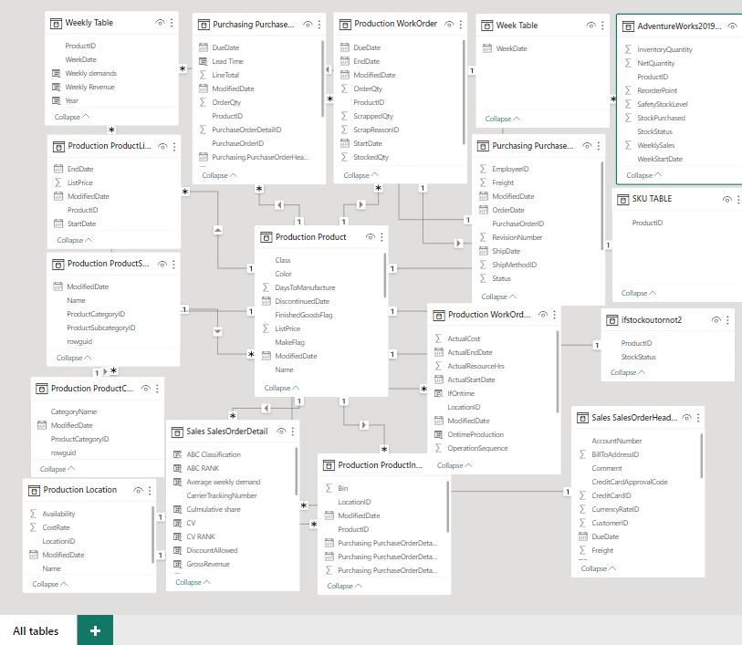
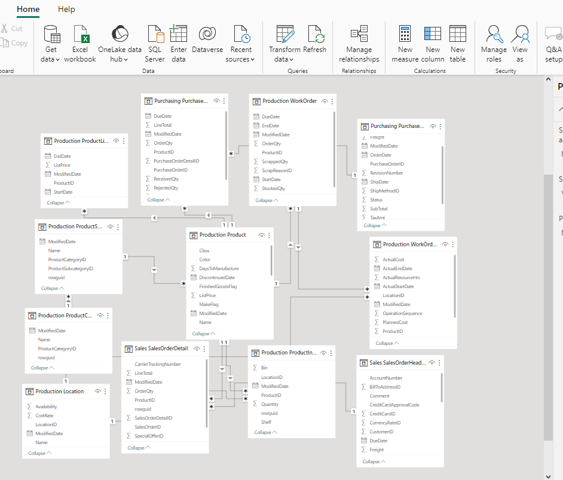
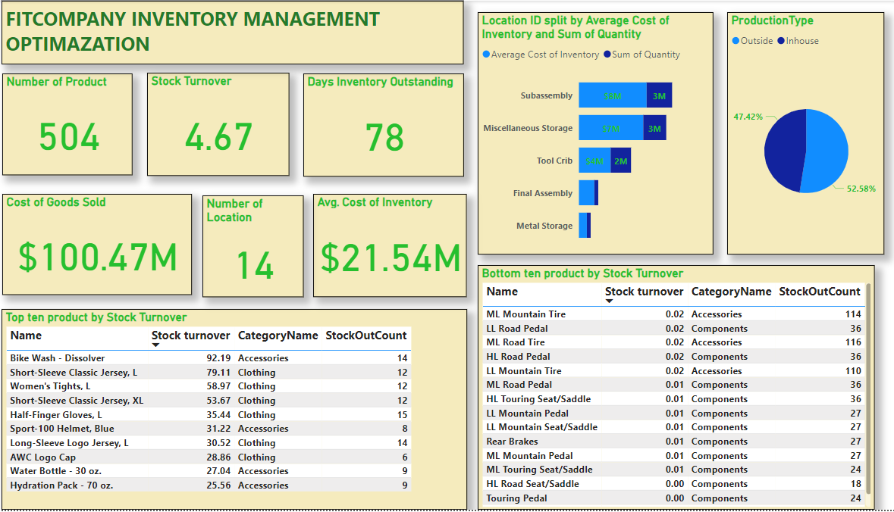
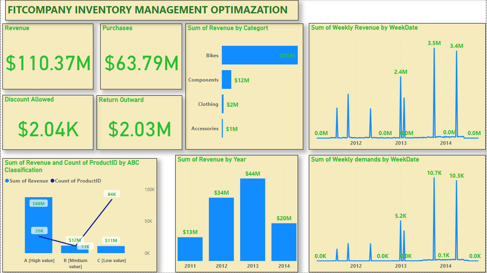
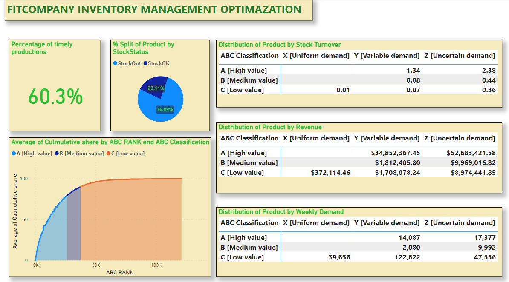
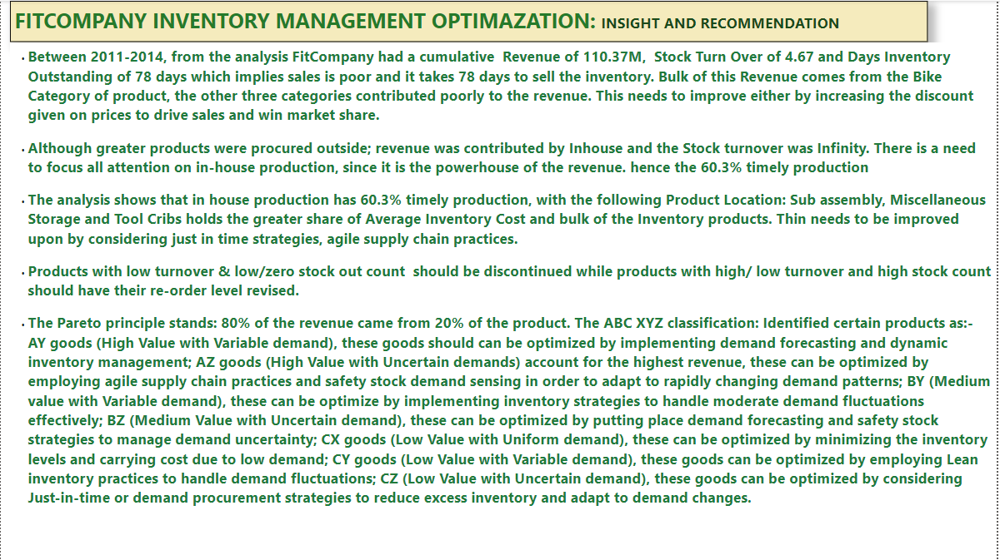

# Optimization-of-Inventory-Management

# Introduction

The project seeks to optimize the inventory management of FitCompany. This is done by analyzing the inventory, purchasing, production and sales data using the tools: Power BI and Microsoft SQL Server Management studio, from AdventureWorks 2019 database.

N.B Kindly note that FitCompany is a ficticious company, Microsoft curated AdventuredWorks2019 solely for learning.

# Problem Statement

* identify which of the products have the highest turnover rate/the lowest turnover rate. 
* average time a product is out of stock and the frequency of stockouts.
* use the insights gained to make recommendations for how to optimize inventory levels and minimize stockouts. This may include adjustments to reorder points, ordering certain products, or discontinuing products that are not selling well.

# Skills I show-cased

* PowerBI concepts like:
* creating columns for calculations for dates, time, and duration
* Creating key performance indicators (KPIs) and other business calculations
* Developing general DAX calculations that deal with text and numbers
* Performed DAX calculations for solving statistical measures and other mathematical formulas
* Data Modelling
* Measures
* filters
* Data Visualization
* SQL Concepts Like:
* Alias, Joins,  

# Dataset Source

The data used for this work is obtained from the AdventureWorks 2019 database 2019; of which  I studied the Schema, Objects related to the Schema,  data dictionary and found the right tables for the analysis.

You can find a link to get started with installation and restoration of the database to your local machine [here](https://techcommunity.microsoft.com/t5/educator-developer-blog/data-analysis-challenge-optimizing-inventory-management/ba-p/3719598?WT.mc_id=academic-86959-ooyinbooke).

# Data Transformation

After care studying of the Schema, Objects related to the Schema,  data dictionary; I  found the following right tables for the analysis.

* I then imported it into PowerBI for analysis

# Data Modelling

Automatically derived relationship between the tables were refined to answer the problem statement

Refined Model             |               Automated Model
:-----|-----:
      |      

I wrote some Dax and creating measures and calculated columns to get the right metrics for the Inventory analysis.
Some of the tables in the model were queries I wrote on SQL Microsoft Server from the AdventureWork2019 dataset.

# Analysis

Listed below are some of the DAX formular and calculated Columns solve the problem objectives:

Average Cost of Inventory = SUMX('Production ProductInventory', 'Production ProductInventory'[Quantity] *
    RELATED('Production Product'[StandardCost]))
    
COGS = SUMX('Sales SalesOrderDetail','Sales SalesOrderDetail'[OrderQty]*RELATED('Production Product'[StandardCost]))

Stock turnover = [COGS]/[Average Cost of Inventory]

SalesCycle = DATEDIFF('Production Product'[SellStartDate],'Production Product'[SellEndDate],DAY)

AvgStockOutDuration = AVERAGE('Production Product'[SalesCycle])

Frequency of OutofStock = SUM('Sales SalesOrderDetail'[ProductID])/COUNT('Sales SalesOrderDetail'[ProductID])
OnTimeProductionPercent =
VAR Num_0 = COUNTROWS(FILTER('Production WorkOrderRouting', 'Production WorkOrderRouting'[IfOntime] = "NotOntime"))
VAR Num_1 = COUNTROWS(FILTER('Production WorkOrderRouting', 'Production WorkOrderRouting'[IfOntime] = "Ontime"))
RETURN DIVIDE(Num_1, Num_0 + Num_1)

LeadTime = DIVIDE(SUM( 'Production WorkOrderRouting'[ActualResourceHrs]),SUM ('Production WorkOrder'[OrderQty]))

OntimeProduction = DATEDIFF('Production WorkOrderRouting'[ActualStartDate],'Production WorkOrderRouting'[ActualEndDate],DAY)

IfOntime = if('Production WorkOrderRouting'[OntimeProduction]<=12, "Ontime","NotOntime")

Purchases = sum('Purchasing PurchaseOrderDetail'[LineTotal])

Return Outward = sumx('Purchasing PurchaseOrderDetail','Purchasing PurchaseOrderDetail'[RejectedQty]*'Purchasing PurchaseOrderDetail'[UnitPrice])

ABC Classification = IF('Sales SalesOrderDetail'[Culmulative share]<=80,"A [High value]",if('Sales SalesOrderDetail'[Culmulative share]<=90,"B [Medium value]","C [Low value]"))

ABC RANK = RANK.EQ('Sales SalesOrderDetail'[Culmulative share], 'Sales SalesOrderDetail'[Culmulative share],ASC)

Average weekly demand = CALCULATE(
    AVERAGE('Weekly Table'[Weekly demands]),
    FILTER('Weekly Table',
    'Weekly Table'[ProductID] = 'Sales SalesOrderDetail'[ProductID]))+0
    
Culmulative share = CALCULATE(
    SUM('Sales SalesOrderDetail'[Revenue Share %]),
    FIlter('Sales SalesOrderDetail',  'Sales SalesOrderDetail'[Revenue Share %]>= EARLIER('Sales SalesOrderDetail'[Revenue Share %])))
    
CV = if('Sales SalesOrderDetail'[SD of weekly demand]> 0,DIVIDE('Sales SalesOrderDetail'[SD of weekly demand],'Sales SalesOrderDetail'[Average weekly demand]),1000)

CV RANK = RANK.EQ('Sales SalesOrderDetail'[CV],'Sales SalesOrderDetail'[CV],ASC)

DiscountAllowed = 'Sales SalesOrderDetail'[UnitPriceDiscount]*'Sales SalesOrderDetail'[OrderQty]

GrossRevenue = 'Sales SalesOrderDetail'[OrderQty]*'Sales SalesOrderDetail'[UnitPrice]

ProjectedInventory = ('Sales SalesOrderDetail'[Production ProductInventory.Quantity] + 'Sales SalesOrderDetail'[Purchasing PurchaseOrderDetail.StockedQty]) - ('Sales SalesOrderDetail'[Average weekly demand] * COUNT('Sales SalesOrderDetail'[Sales SalesOrderHeader.OrderDate]))

Revenue = 'Sales SalesOrderDetail'[GrossRevenue]-'Sales SalesOrderDetail'[DiscountAllowed]

Revenue Share % = DIVIDE('Sales SalesOrderDetail'[Revenue],sum('Sales SalesOrderDetail'[Revenue]))*100

SD of weekly demand = CALCULATE(
    STDEV.P('Weekly Table'[Weekly demands]),
    FILTER('Weekly Table',
    'Weekly Table'[ProductID] = 'Sales SalesOrderDetail'[ProductID]))+0
    
XYZ Classification = if('Sales SalesOrderDetail'[CV RANK]<=0.2*max('Sales SalesOrderDetail'[CV RANK]),"X [Uniform demand]",if('Sales SalesOrderDetail'[CV RANK]<=0.5*max('Sales SalesOrderDetail'[CV RANK]),"Y [Variable demand]", "Z [Uncertain demand]"))

### I created SKU Table
SKU TABLE = SUMMARIZE('Production Product',
'Production Product'[ProductID])
Purchases
Earlier Days
Late Days

Week Table = GENERATESERIES(TODAY()-4371,Today()-3285,7)

Weekly demands = CALCULATE(
    sum('Sales SalesOrderDetail'[OrderQty]),
    FILTER('Sales SalesOrderHeader',
    'Sales SalesOrderHeader'[OrderDate] = 'Weekly Table'[WeekDate] &&
    'Sales SalesOrderHeader'[OrderDate]<= 'Weekly Table'[WeekDate]))+0
    
Weekly Revenue = CALCULATE(
    sum('Sales SalesOrderDetail'[Revenue]),
    FILTER('Sales SalesOrderHeader',
    'Sales SalesOrderHeader'[OrderDate] = 'Weekly Table'[WeekDate] &&
    'Sales SalesOrderHeader'[OrderDate]<= 'Weekly Table'[WeekDate]))+0
Year = year('Weekly Table'[WeekDate])

# Visuals

The report consist of four pages

Overview Page

Sales Page

Inventory Page

Insight and Recommendation Page

Below are the Report

Overview Page

Sales Page

Inventory Page

Insight and Recommendation Page

# Limitation
The lack of record of date inventory stocks were taken hinder me to predict when the stock will go out of stock.

