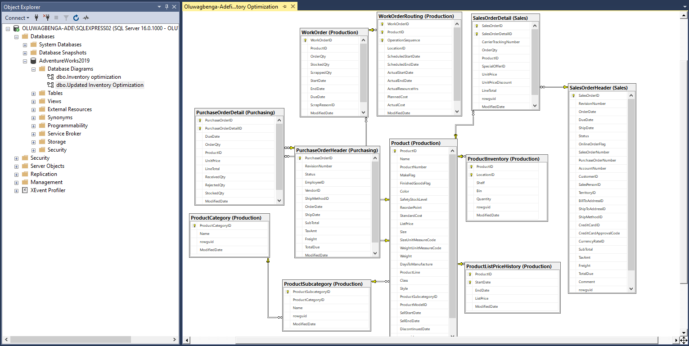
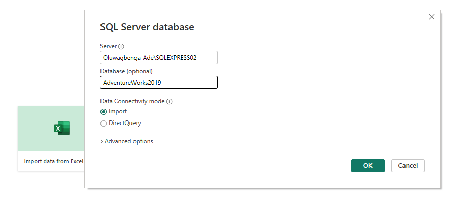
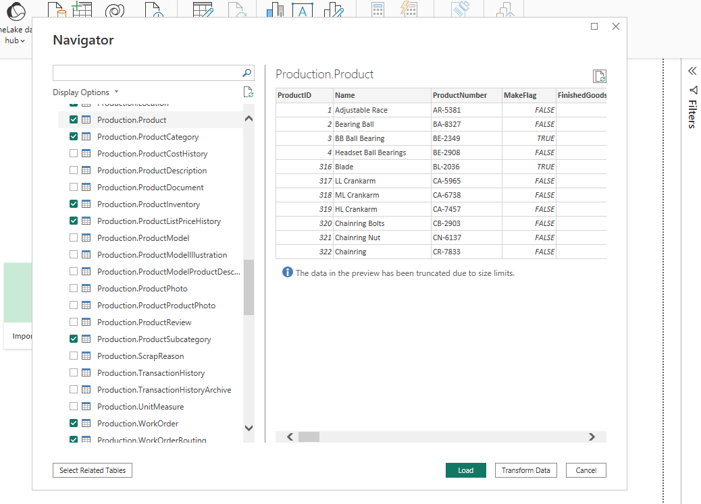
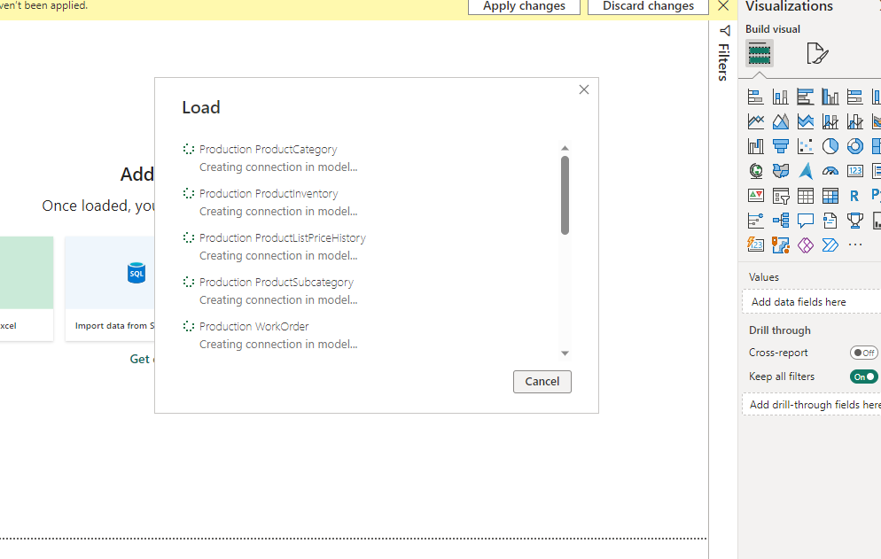
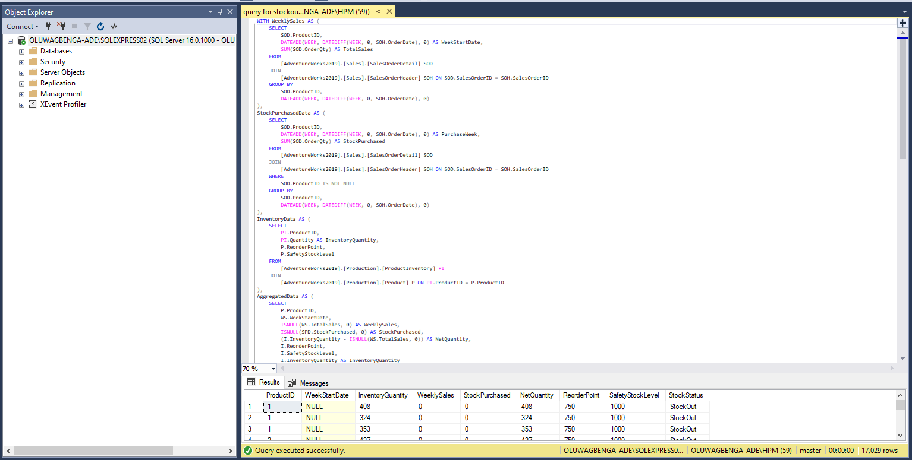
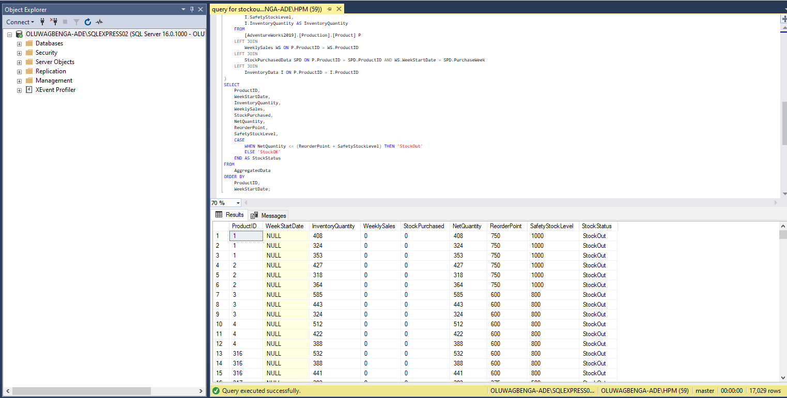

# Optimization-of-Inventory-Management

# Introduction

The project seeks to optimize the inventory management of FitCompany. This is done by analyzing the inventory, purchasing, production and sales data using the tools: Power BI and Microsoft SQL Server Management studio, from AdventureWorks 2019 database.

N.B Kindly note that FitCompany is a ficticious company, Microsoft curated AdventuredWorks2019 solely for learning.

# Problem Statement

* identify which of the products have the highest turnover rate/the lowest turnover rate. 
* average time a product is out of stock and the frequency of stockouts.
* use the insights gained to make recommendations for how to optimize inventory levels and minimize stockouts. This may include adjustments to reorder points, ordering certain products, or discontinuing products that are not selling well.

# Skills I show-cased

* PowerBI concepts like:
* creating columns for calculations for dates, time, and duration
* Creating key performance indicators (KPIs) and other business calculations
* Developing general DAX calculations that deal with text and numbers
* Performed DAX calculations for solving statistical measures and other mathematical formulas
* Data Modelling
* Measures
* filters
* Data Visualization
* SQL Concepts Like:
* Alias, Joins,  

# Dataset Source

The data used for this work is obtained from the AdventureWorks 2019 database 2019; of which  I studied the Schema, Objects related to the Schema,  data dictionary and found the right tables for the analysis.

You can find a link to get started with installation and restoration of the database to your local machine [here](https://techcommunity.microsoft.com/t5/educator-developer-blog/data-analysis-challenge-optimizing-inventory-management/ba-p/3719598?WT.mc_id=academic-86959-ooyinbooke).

# Data Transformation

After care studying of the Schema, Objects related to the Schema,  data dictionary; I  found the following right tables for the analysis.

* I then imported it into PowerBI for analysis

I wrote some Dax and creating measures and calculated columns to get the right metrics for the Inventory analysis.
The queries I wrote on SQL are compiled and also uploaded here in this repository.

